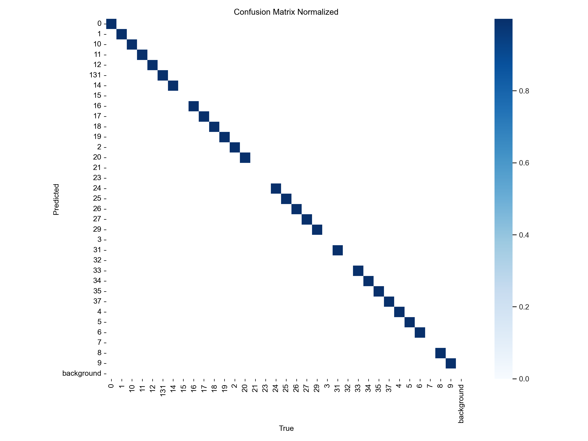
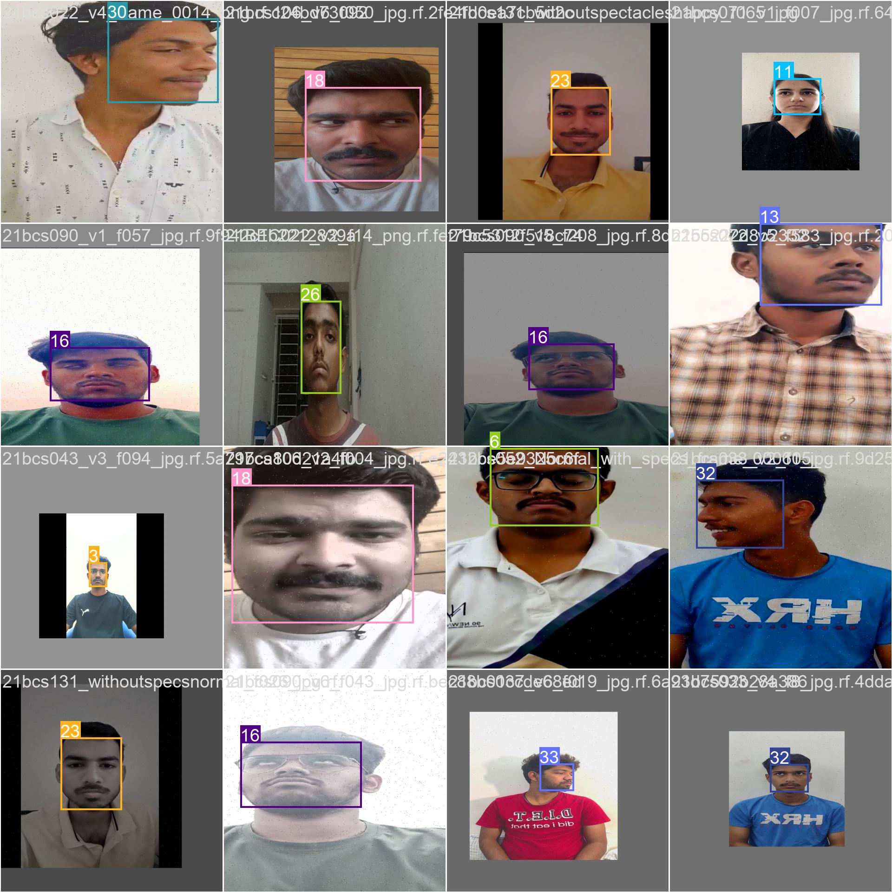
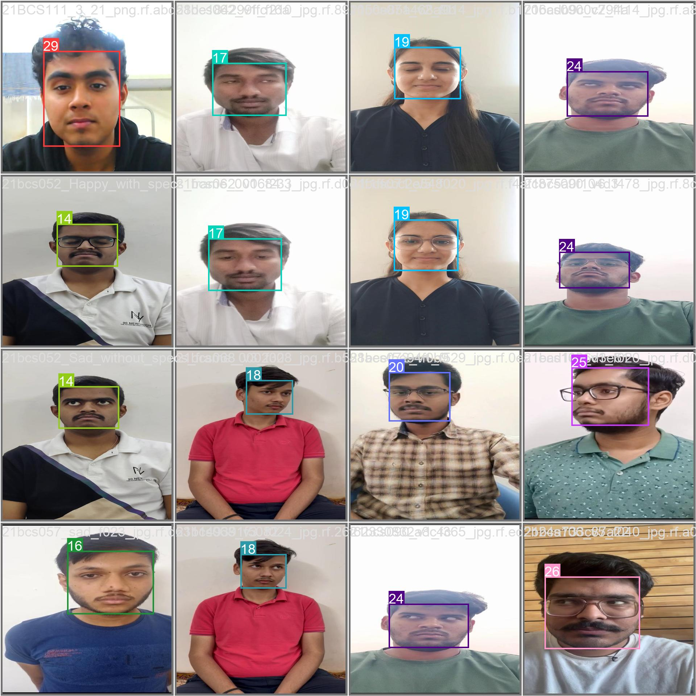

# Face Recognition Attendance System

## Overview

The Face Recognition Attendance System is an advanced, automated attendance system that leverages the power of deep learning and computer vision. This system uses YOLOv8 for face detection to identify students in a classroom setting. The professor only needs to take a photo of the class, and the system will automatically recognize the faces and mark attendance.

## Tech Stack

- *Python*: The core programming language for implementing the deep learning model.
- *YOLOv8*: The deep learning model used for face detection.
- *Roboflow*: For data augmentation and dataset management.
- *Ultralytics YOLO*: A high-performance, easy-to-use library for object detection.
- *PyTorch*: The deep learning framework used for training the model.
- *Jupyter Notebook*: For interactive development and debugging.
- *Visual Studio Code*: The code editor used for development.

## Methodology

1. *Data Collection*: Images of students were collected and annotated with their respective IDs.
2. *Data Augmentation*: Using Roboflow, the dataset was augmented to create a more robust training set. Techniques included rotation, scaling, flipping, and color adjustments.
3. *Model Training*: YOLOv8 was trained on the augmented dataset to detect and recognize faces.
4. *Evaluation*: The trained model was evaluated using a test set, and performance metrics were calculated, including the confusion matrix.
5. *Deployment*: The model was integrated into a system where professors can upload classroom images, and the model will automatically recognize students and mark their attendance.

## Installation and Setup

1. *Clone the repository*:
   bash
   git clone https://github.com/HiBorn4/FaceReg_IPCV_Face_Recognition
   cd face-recognition-attendance
   

2. *Set up a virtual environment*:
   bash
   python -m venv venv
   source venv/bin/activate  # On Windows: venv\Scripts\activate
   

3. *Install dependencies*:
   bash
   pip install -r requirements.txt
   

4. *Download the dataset and place it in the appropriate directory*.

5. *Run the Jupyter notebook*:
   bash
   jupyter notebook
   

6. *Follow the steps in the FaceDetection_updated.ipynb notebook to train the model*.

## Dataset

The dataset used consists of annotated images of students. Each image is labeled with the corresponding student ID.

### Labels
The labels used in the dataset are as follows:

json
{
    "0": "21BCS001",
    "1": "21BCS009",
    "2": "21BCS010",
    "3": "21BCS011",
    ...
    "37": "21BEC055",
    "100": "UNKNOWN"
}

## Model Training

The model was trained using YOLOv8 with the following command:

python
!yolo task=detect mode=train model=yolov8n.pt data=/path/to/data.yaml epochs=25 imgsz=640

## Challenges and Solutions

### Challenge 1: Data Annotation
- *Problem*: Annotating a large dataset manually is time-consuming.
- *Solution*: Used Roboflow to streamline the annotation process and applied data augmentation techniques to expand the dataset.

### Challenge 2: GPU Memory Limitations
- *Problem*: Training on large image sizes caused out-of-memory errors.
- *Solution*: Reduced the image size from 800x800 to 640x640 and used batch sizes that fit into the available GPU memory.

### Challenge 3: Model Performance
- *Problem*: The initial model had low accuracy.
- *Solution*: Tweaked hyperparameters, used a larger dataset, and employed data augmentation to improve model robustness.

## Results

The model achieved satisfactory accuracy in detecting and recognizing faces in classroom images. Below are the evaluation metrics and confusion matrix.

### Confusion Matrix

### Sample Detections

## Future Work

- *Enhance Model Accuracy*: Experiment with different YOLO versions and hyperparameters.
- *Real-time Processing*: Implement real-time face detection and recognition using video feeds.
- *Scalability*: Develop a web-based interface for easy deployment and access.

## Conclusion

This project demonstrates the application of YOLOv8 for automated attendance systems using face recognition. By leveraging advanced deep learning techniques and robust data augmentation, the system achieves high accuracy and reliability, providing a seamless solution for classroom attendance management.